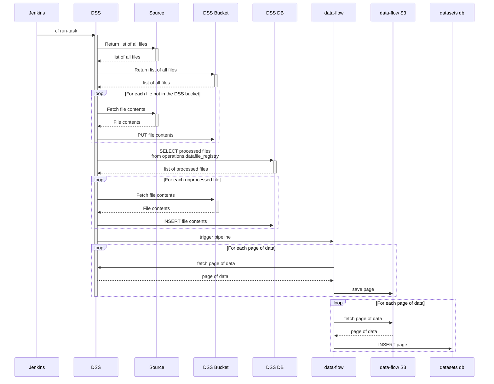

# Data store service
The data store service aims to store data from external sources that changes infrequently.

This data is then pushed to data workspaces for analysts to use.

## Integration with data-flow and Data Workspace's datasets database

Data is ingested into Data Workspace's datasets database every night, triggered by a job in Jenkins, leveraging data-flow. The following sequence diagram shows the high level steps involved for each source.

## Installation
The backend is built in Python using the Flask framework. Authentication implemented using Hawk and OAUTH2(SSO) authentication. The majority of the functionality is through API calls but a light front end is provided for documentation and dashboarding. This front end uses React and d3 and uses the webpack javascript module bundler. 

### Docker installation
1. Copy `.envs/docker.env` to `.env`
2. `docker compose up --build`
3. Go to http://localhost:5050/healthcheck

Running postgres in docker now requires a mandatory environment variable called POSTGRES_PASSWORD. This must be added to your .env file.

### Docker run tests
1. `docker exec -it data_dss_web_1 make run_tests`

### Running tests locally

`make run_tests_local`

### to run tests for a specific directory, do,

`make run_tests_local TEST=<tests/test_directory>`

### Running tests the same way as circle ci:

`make run_tests`

## Config

### When using docker-compose
Place environment variables in .env file.

### When using host machine
Config variables can be specified in a few ways and are loaded using the following order of priority:

1. Look for variable in existing System environment variables
2. If not found in step 1, look for variable in `.env` (this only works if USE_DOTENV is set to 1, see .envs/sample.env for an example file)
3. If not found in step 2, look for variable in `local_testing.yml` (this only works if TESTING is set to 1)
4. If not found in step 3, look for variable in `local.yml` (this only works if TESTING is set to 0)
5. If not found in step 4, look for variable in `default.yml`

## Example dataset
ONS Postcode directory: http://geoportal.statistics.gov.uk/datasets/ons-postcode-directory-november-2019

## Creating an S3 bucket
An s3 bucket can be created using the Cloud Foundry command line tools, e.g.

1. `cf create-service aws-s3-bucket default data-store-service-s3`
2. `cf bind-service data-store-service data-store-service-s3`
3. `cf restage data-store-service`
4. To get access outside of PaaS you will need to create a service key, `cf create-service-key data-store-service-s3 s3-key -c '{"allow_external_access": true}'`
5. To get the credentials for s3 use then command, `cf service-key data-store-service-s3 s3-key`

Reference: 
https://docs.cloud.service.gov.uk/deploying_services/s3/#connect-to-an-s3-bucket-from-your-app

## Running database migrations

Database migrations currently are not run automatically on deployment because there is concern that they do not work well for the pipeline tables. Until this is resolved, migrations need to be run manually and consideration needs to be given to how this will affect deploying structural database changes.

1) Deploy the migrations to the relevant environment.
2) `cf v3-ssh data-store-service-<env>` - SSH into the instance
3) `/tmp/lifecycle/shell` - active the app environment
4) `./manage.py db upgrade` - run the migrations
