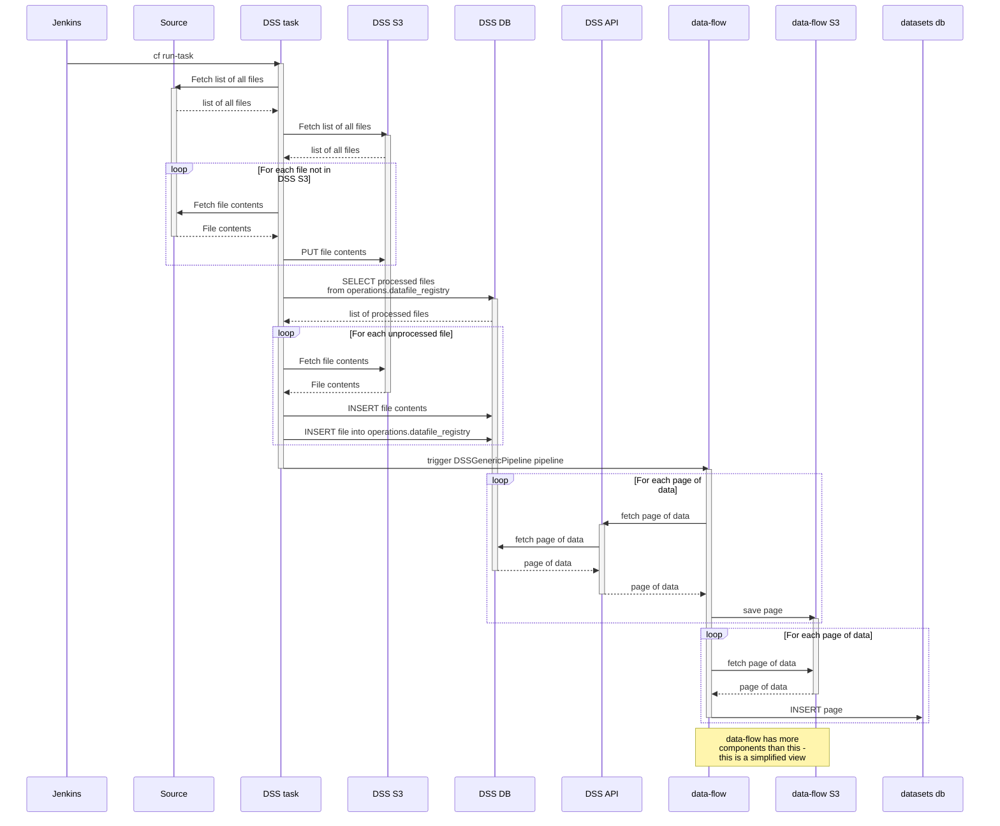

# Data Store Service

The Data Store Service stores data that changes infrequently. It takes data from

- A variety of external sources that expose data via HTTP
- CSV upload through a web interface

and exposes it via a HAWK authenticated API that is used by

- A data-flow pipeline, DSSGenericPipeline, that ingests the data into the Data Workspace datasets database
- External clients

### Contents

- [Architecture](#architecture)
- [Data flows](#data-flows)
- [Running locally](#running-locally)
- [Running tests](#running-tests)
- [Configuration](#configuration)
- [Running database migrations](#running-database-migrations)


## Architecture

The backend is built in Python using [data-engineering-common](https://github.com/uktrade/data-engineering-common), that itself uses [Flask](https://flask.palletsprojects.com/en/3.0.x/). Functionality is exposed via a JSON API for data access, and via an HTML and Javascript front end for uploading CSV files. The API uses HAWK authentication, and the front end uses OAuth 2.0 (SSO) authentication. The front end is built using webpack.

Backend processes are triggered from Jenkins as CloudFoundry tasks. There is a background `scheduler` process built in that is currently not used.


## Data flows

There are 3 data flows that the Data Store Service affords:

- External sources to external clients
- External sources into the Data Workspace datasets database
- CSV uploads into the Data Workspace datasets database

> It is technically possible for CSV uploads to be accessible to external clients, but this is not currently used

The most complex of these is the flow from external sources into the Data Workspace datasets database. These are triggered by a job in Jenkins every night, where data is pulled from external sources into the Data Store Service, and then via data-flow is ingested into the Data Workspace datasets database. The following sequence diagram shows the high level steps involved for each source.



## Running locally

To run the Data Store Service locally

1. Clone this repository

   ```shell
   git clone git@github.com:uktrade/data-store-service.git
   cd data-store-service
   ```

2. Copy `.envs/docker.env` to `.env`

   ```shell
   cp .envs/docker.env .env
   ```

3. Start the Data Store Service

   ```shell
   docker compose up --build
   ```

4. Go to http://localhost:5050/healthcheck

## Running tests

Once the Data Store Service is running locally, to run all the tests run

```shell
docker exec -it data-dss_web-1 make run_tests
```

or to run the tests for a specific directory, run

```shell
docker exec -it data-dss_web-1 make run_tests TEST=<tests/test_directory>
```


## Configuration

Configuration is controlled by environment variables, but these are typically not used directly, but via [app/config/defaults.yml](app/config/defaults.yml), exposed via the `flask_app.config` object.

When developing locally, environment variables can be placed in the `.env` file. 


## Running database migrations

Database migrations currently are not run automatically on deployment because there is concern that they do not work well for the pipeline tables. Until this is resolved, migrations need to be run manually and consideration needs to be given to how this will affect deploying structural database changes.

1) Deploy the migrations to the relevant environment.
2) `cf v3-ssh data-store-service-<env>` - SSH into the instance
3) `/tmp/lifecycle/shell` - active the app environment
4) `./manage.py db upgrade` - run the migrations
